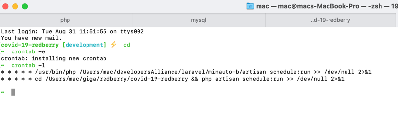

Users seeder <br>
```php artisan db:seed --class=UsersTableSeeder```

To get Countries in Country table <br>
```php artisan get:countries ```

To update statistics manually <br>
```php artisan get:statistics```

To activate schedule, add this in your cron configuration enrty <br>
```* * * * * cd /path-to-your-project && php artisan schedule:run >> /dev/null 2>&1```

for me it's <br>
``` * * * * * cd /Users/mac/giga/redberry/covid-19-redberry && php artisan schedule:run >> /dev/null 2>&1 ```

open terminal <br> 
``` crontab -e``` to open cron configuration, place your configuration and save.
```crontab -l``` will show you active cronjobs.



like this for example.
